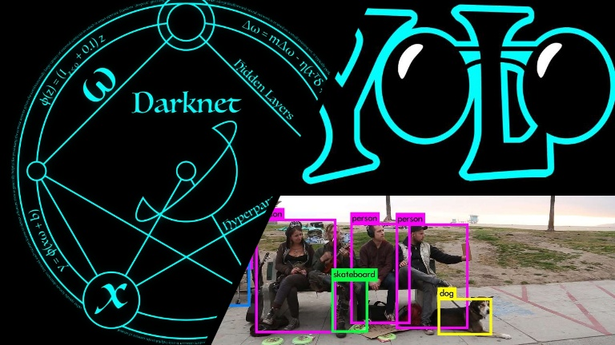

# Object Detection with YOLO

Basics
1) Object Localization is what and where a single object is in the image.

2) Object Detection is what and where multiple objects are in the image.

IOU
<li>
	Assuming top left and bottom right coords of two boxes are passed as args (two predicted or one actual vs one predicted).
</li>
<li>
	Intersection coords top left = max_x(topleft box1, topleft box2), max_y(topleft box1, topleft box2)	
</li>
<li>Intersection coords bottom right = min_x(bottom_right box1, bottom_right box2), min_y(bottom_right box1, bottom_right box2)</li>

<b>Non Max Supression</b>
<ul>
	<li>Helps in clearing the cluter or if same object center is detected in multiple grids or may be same grid</li>
	<li>In YoloV1 each grid predicts two bouding boxes, among which we choose one. One grid can only detect one object. </li>
	<li>Take all bounding boxes from all grids having confidence score above the choosen threshold e.g. 0.5</li>
	<li>Take bounding boxes from a particular class at a time.</li>
	<li>Take those same class boxes and find IOU of every box with other boxes.</li>
	<li>If the IOU is greater than a given threshold</li>
</ul>
